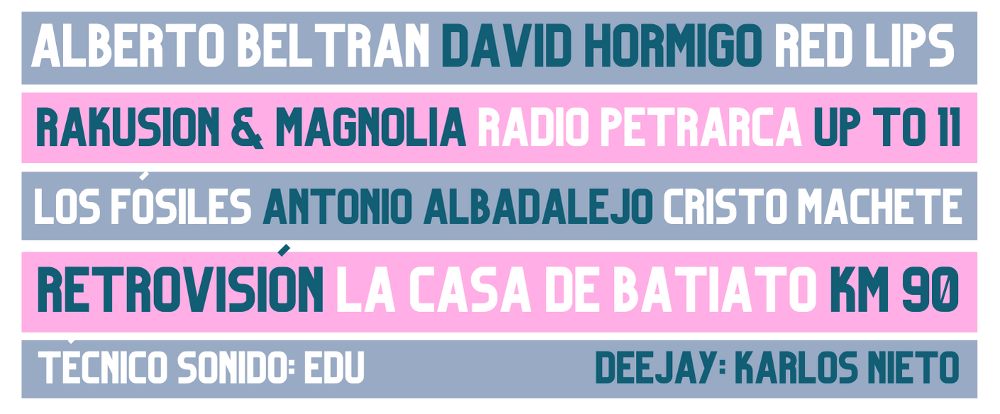

# Minifest Benéfico


## Descripción
Minifest Benéfico es un proyecto diseñado para organizar y promocionar eventos benéficos. Este proyecto utiliza Astro para la creación de una página web moderna y atractiva.

## Estructura del Proyecto
El proyecto está organizado de la siguiente manera:

- **public/**: Contiene recursos públicos como imágenes y fuentes.
- **src/assets/**: Archivos de imágenes y gráficos utilizados en el proyecto.
- **src/components/**: Componentes reutilizables de la interfaz de usuario.
- **src/data/**: Archivos de datos para alimentar la aplicación.
- **src/icons/**: Iconos SVG utilizados en la página.
- **src/layouts/**: Plantillas de diseño para las páginas.
- **src/pages/**: Páginas principales del sitio web.
- **src/styles/**: Archivos CSS para los estilos globales.
- **src/types/**: Definiciones de tipos TypeScript.

## Tecnologías Utilizadas
- **Astro**: Framework para construir sitios web rápidos.
- **TypeScript**: Lenguaje de programación tipado.
- **CSS**: Para los estilos visuales.

## Instalación
1. Clona este repositorio:
   ```bash
   git clone <URL_DEL_REPOSITORIO>
   ```
2. Instala las dependencias:
   ```bash
   npm install
   ```
3. Inicia el servidor de desarrollo:
   ```bash
   npm run dev
   ```

## Capturas de Pantalla
### Página Principal


### Grupos Participantes


## Contribución
Si deseas contribuir a este proyecto, por favor sigue los pasos a continuación:
1. Haz un fork del repositorio.
2. Crea una nueva rama para tu funcionalidad o corrección de errores:
   ```bash
   git checkout -b feature/nueva-funcionalidad
   ```
3. Realiza tus cambios y haz un commit:
   ```bash
   git commit -m "Agrega nueva funcionalidad"
   ```
4. Envía tus cambios:
   ```bash
   git push origin feature/nueva-funcionalidad
   ```
5. Abre un Pull Request.

## Licencia
Este proyecto está bajo la Licencia MIT. Consulta el archivo LICENSE para más detalles.